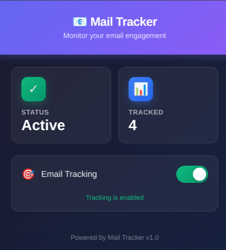
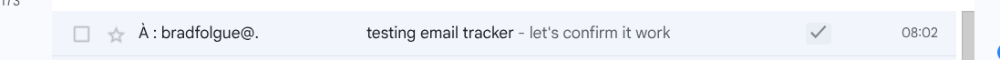
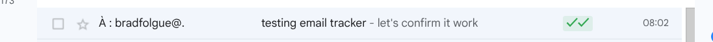

<div align="center">
  

  # Mail Tracker

  ### Chrome Extension to track Gmail email opens in real-time

  [](https://chrome.google.com)
  [](https://developer.chrome.com/docs/extensions/mv3/)
  [](https://socket.io/)

</div>

---

## ✨ Features

- 📧 **Automatic injection** of tracking pixel when sending emails
- 🔔 **Real-time notifications** via WebSocket (< 1 second)
- 👁️ **Visual indicators** in Gmail interface
  - ✓ = Email sent and tracked
  - ✓✓ = Email opened by recipient
- 🌙 **Modern popup** with dark theme
- 🎯 **ON/OFF toggle** to enable/disable tracking
- 🚀 **No configuration required** - Ready to use out of the box

---

## 📸 Screenshots

<div align="center">

### Modern popup with dark theme


*Elegant interface to view your tracking statistics*

### Indicators in Gmail (Email sent)


*A ✓ indicates the email was sent with tracking*

### Indicators in Gmail (Email opened)


*Two ✓✓ indicate that the recipient opened the email*

</div>

---

## 🚀 Installation

### Developer Mode Installation

1. Open Chrome and navigate to `chrome://extensions/`
2. Enable **"Developer mode"** (top right corner)
3. Click **"Load unpacked"**
4. Select the `add-on/` folder
5. ✅ That's it! The extension is ready to use

**No configuration needed** - The API URL is already configured to point to the production server.

---

## 📖 Usage

### 1. Send a tracked email

1. Open **Gmail** (https://mail.google.com)
2. Compose a new email as usual
3. Write your message and click **Send**
4. 🎯 The extension automatically injects the tracking pixel
5. A ✓ appears next to the email in your sent folder

### 2. See when the email is opened

- When the recipient opens the email, the ✓ becomes ✓✓ **in real-time** (< 1 second)
- Hover over ✓✓ to see details (recipient, date/time of opening)

### 3. Enable/Disable tracking

1. Click the extension icon in the toolbar
2. Use the **toggle** to enable/disable tracking
3. When disabled, no pixel is injected and no data is sent

---

## 🏗️ Architecture

```
add-on/
├── manifest.json              # Extension configuration (Manifest V3)
├── popup.html                 # Popup interface with dark theme
├── icons/                     # Extension icons
│   ├── icon16.png
│   ├── icon48.png
│   └── icon128.png
├── assets/                    # Screenshots for documentation
│   ├── mail-tracker-popup.png
│   ├── mail-tracker-sent.png
│   └── mail-tracker-open.png
├── scripts/
│   ├── config.js             # API configuration (hard-coded URL)
│   ├── popup.js              # Popup logic (stats, toggle)
│   ├── background.js         # Service worker (WebSocket, API)
│   ├── content.js            # Script injected in Gmail
│   └── socket.io.min.js      # WebSocket client
└── styles/
    └── content.css           # Styles for Gmail UI
```

---

## 🔌 Technologies

### Real-time WebSocket
The extension uses **Socket.IO** to receive instant notifications:
- ✅ No polling (zero repeated requests)
- ✅ Notifications in < 1 second
- ✅ Automatic reconnection
- ✅ Battery and bandwidth savings

### Manifest V3
- **Service Worker** for background (no persistent background page)
- **Content Script** to modify Gmail
- **Chrome Storage API** for local persistence

---

## 🔐 Required Permissions

| Permission | Usage |
|------------|-------|
| `storage` | Store tracked emails and preferences |
| `activeTab` | Access active Gmail tab |
| `https://mail.google.com/*` | Inject script into Gmail |
| `https://mail-tracker-api-production.up.railway.app/*` | Communicate with backend API |

---

## ⚙️ Configuration

### API URL
The API URL is **hard-coded** in `scripts/config.js`:
```javascript
DEFAULT_API_URL: 'https://mail-tracker-api-production.up.railway.app'
```

To change the URL (for local development for example):
1. Edit `scripts/config.js`
2. Change `DEFAULT_API_URL` to `http://localhost:3000`
3. Update `manifest.json` to add permission `http://localhost:3000/*`

---

## 🎨 Popup Interface

The modern popup displays:
- ✅ **Status**: Active / Inactive
- 📊 **Number of tracked emails**
- 🌐 **Connection status** to server
- 🎯 **Toggle** to enable/disable tracking

Design:
- Elegant dark theme
- Smooth animations
- Glassmorphism (frosted glass effect)
- Modern gradients (purple/indigo)

---

## 🔧 Development

### Code Structure

**Background Script (background.js)**
- WebSocket connection to server
- Listen for `email:opened` events
- Update local storage
- Communication with content scripts

**Content Script (content.js)**
- Monitor Gmail compose windows
- Inject tracking pixel
- Display ✓/✓✓ indicators
- Real-time UI updates

**Popup (popup.js)**
- Display statistics
- Handle tracking toggle
- Counter animations

### Debugging

**Background Script Console:**
1. Go to `chrome://extensions`
2. Click "Service worker" under Mail Tracker
3. Observe WebSocket logs

**Gmail Page Console:**
1. Open Gmail
2. F12 → Console
3. Observe content script logs

---

## ⚠️ Known Limitations

- ✋ Works only with **Gmail** (not Outlook, Yahoo, etc.)
- 🖼️ Images must be enabled on recipient's side
- 🔒 Mail proxies (Apple Mail Privacy, Gmail Proxy) may give false positives
- 📱 Some mobile clients may block the pixel

---

## 📊 Complete Workflow

```
1. User composes an email in Gmail
   ↓
2. Extension injects tracking pixel before sending
   ↓
3. Email sent → Backend registers the email
   ↓
4. Recipient opens email → Pixel loaded
   ↓
5. Backend detects opening → Emits WebSocket event
   ↓
6. Extension receives event in real-time (< 1s)
   ↓
7. Gmail UI updated: ✓ → ✓✓
```

---

## 🤝 Support

To report a bug or request a feature, open an issue on GitHub.
